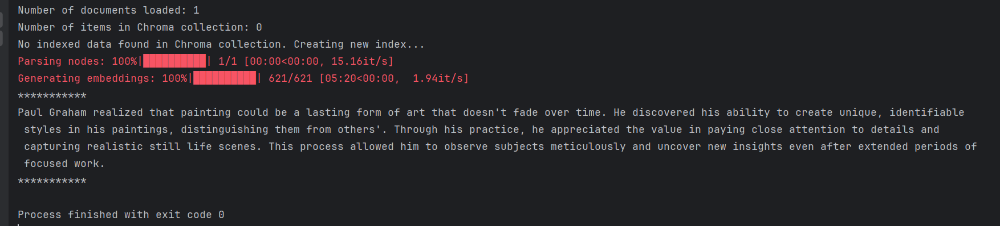
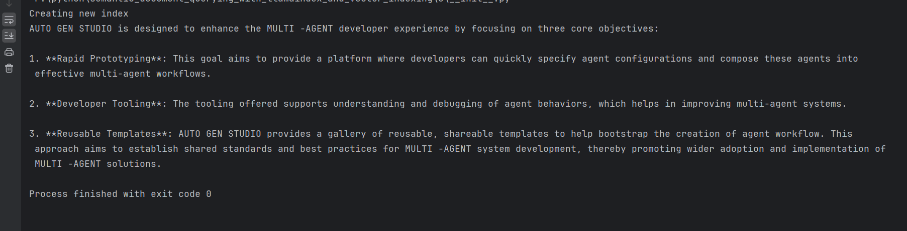
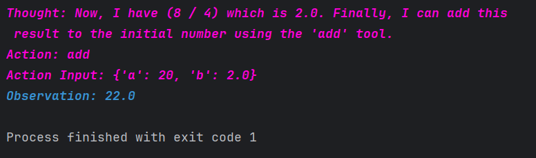
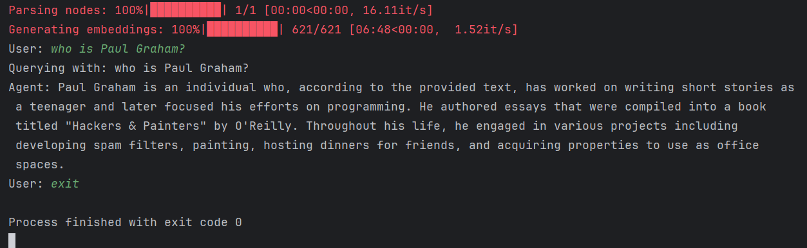

# Semantic Document Querying with LlamaIndex and Vector Indexing

This repository showcases four projects that demonstrate the power of **LlamaIndex** and **vector indexing** for semantic document querying, retrieval, and conversational AI. These projects highlight my skills as an AI engineer in building scalable, efficient, and intelligent systems for document querying, math expression evaluation, and conversational agents.


---

## Table of Contents

1. [Project Overview](#project-overview)
2. [Summary of Projects](#summary-of-projects)
3. [Key Features](#key-features)
4. [Acknowledgments](#Acknowledgments)
5. [Projects](#projects)
    - [1. Document Query Engine with ChromaDB](#1-document-query-engine-with-chromadb)
    - [2. Document Indexing and Retrieval](#2-document-indexing-and-retrieval)
    - [3. Math Expression Evaluator using ReAct Agent and LLM](#3-math-expression-evaluator-using-react-agent-and-llm)
    - [4. Full Conversational Chatbot in CMD](#4-full-conversational-chatbot-in-cmd)
6. [What is `setup_models`?](#what-is-setup_models)

---

## Project Overview

This repository brings together four projects that leverage **LlamaIndex**, **ChromaDB**, and **ReAct Agents** to build advanced AI-powered systems.

Each project has a different use case:

- ranging from semantic document querying
- math expression evaluation
- conversational chatbots.

The projects are designed to showcase my expertise in integrating **large language models** (**LLMs**), **vector databases**, and **retrieval-augmented generation (RAG)** techniques.

---

### Summary of Projects

1. **Document Query Engine with ChromaDB**: A semantic document querying system that leverages **ChromaDB** for vector storage and retrieval, enabling efficient **similarity-based search** and **response synthesis**.



---

2. **Document Indexing and Retrieval**: A scalable solution for **document indexing** and **information retrieval**, utilizing **vector embeddings** and persistent storage to quickly query design goals or other content.



---

3. **Math Expression Evaluator using ReAct Agent and LLM**: A step-by-step **math expression evaluator** powered by a **ReAct agent** and custom arithmetic tools, demonstrating **tool integration** and **reasoning capabilities** in AI systems.



---

4. **Full Conversational Chatbot in CMD**: An interactive **conversational chatbot** built with **LlamaIndex** and **vector indexing**, allowing users to query data through a command-line interface with **contextual understanding**.



---

## Key Features

- **Semantic Search**: Use vector embeddings and similarity-based retrieval to query documents semantically.
- **Vector Indexing**: Efficiently store and retrieve document embeddings using ChromaDB.
- **Conversational Agents**: Build interactive chatbots capable of answering questions based on indexed data.
- **Math Expression Evaluation**: Leverage ReAct agents to evaluate complex mathematical expressions step-by-step.
- **Reusable Templates**: Modular design allows easy adaptation for new datasets or use cases.

---

### Acknowledgments

- **LlamaIndex**: For providing powerful tools for indexing and querying documents.
- **LlamaParse**: For enabling robust PDF parsing capabilities.
- **OpenAI**: For powering the natural language processing components.

### Directory Structure

- `data/`: Place your dataset files here (e.g., PDFs, text files).
- `chroma_db/`: Persistent storage for ChromaDB collections.
- `storage/`: Persistent storage for vector indices.

### Configuration

Each project uses a `setup_models` function to configure the underlying LLMs and other settings. This function abstracts away the model initialization process, making it easy to switch between different LLM providers (e.g., OpenAI, Hugging Face).

#### What is `setup_models`?

The `setup_models` function initializes the LLMs and other configurations required for the projects. It typically includes:

- Setting up the embedding model (e.g., OpenAI's `text-embedding-ada-002`).
- Configuring the LLM provider (e.g., GPT-3.5, GPT-4).
- Defining global settings like temperature, max tokens, etc.

Example:

```python
from llama_index.core import Settings
from llama_index.llms.openai import OpenAI


def setup_models():
    Settings.llm = OpenAI(model="gpt-3.5-turbo", temperature=0.1)
    Settings.embed_model = "local"  # or "openai"
```

You can modify this function to experiment with different models or configurations.

---

## Projects

### 1. Document Query Engine with ChromaDB

This project demonstrates how to build a **document query engine** using **ChromaDB** as the vector database. It loads documents, creates a vector index, and performs semantic queries to retrieve relevant information.

#### Key Features:

- Loads documents from a directory.
- Creates or loads a persistent vector index using ChromaDB.
- Uses a retriever and response synthesizer to generate answers.

#### Example Query:

**Input:** "What did Paul Graham learn from his painting experience?"  
**Output:** A detailed response about Paul Graham's insights into painting.

---

### 2. Document Indexing and Retrieval

This project focuses on **document indexing and retrieval**. It indexes documents into a vector store and retrieves information based on user queries.

#### Key Features:

- Indexes documents into a persistent storage (`storage/` folder).
- Loads the index from storage if it already exists.
- Retrieves information using a query engine.

#### Example Query:

**Input:** "What are the design goals and give details about it please."  
**Output:** A summary of the design goals of AUTO GEN STUDIO.

---

### 3. Math Expression Evaluator using ReAct Agent and LLM

This project showcases a **math expression evaluator** powered by a **ReAct agent**. The agent uses tools like addition, subtraction, multiplication, and division to evaluate mathematical expressions step-by-step.

#### Key Features:

- Defines custom tools for basic arithmetic operations.
- Uses a ReAct agent to solve math problems interactively.
- Provides step-by-step reasoning for each calculation.

#### Example Query:

**Input:** "Use a tool to calculate every step of: 20 + (2 * 4) / (5 - 1)"  
**Output:** A step-by-step breakdown of the calculation, resulting in `22`.

---

### 4. Full Conversational Chatbot in CMD

This project builds a **conversational chatbot** that interacts with users via the command line. The chatbot is powered by a vector index and can answer questions based on the indexed data.

#### Key Features:

- Loads data and creates a vector index.
- Uses a chat engine to handle conversational queries.
- Supports interactive conversations until the user types "exit".

#### Example Interaction:

**User:** "What did Paul Graham do after YC?"  
**Agent:** A detailed response about Paul Graham's activities post-Y Combinator.

---

## Conclusion

This repository demonstrates my expertise in building AI-powered systems for semantic document querying, math expression evaluation, and conversational agents. Each project is modular, reusable, and designed to be easily extended for new use cases. By leveraging **LlamaIndex**, **ChromaDB**, and **ReAct agents**, these projects showcase the potential of combining vector indexing and large language models to create intelligent applications.


---

## Contact

For questions or feedback, feel free to reach out:

- Email: mohamed.reda.007007@gmail.com

---
Feel free to explore the code, experiment with different datasets, and adapt the projects to your needs.

Thank you for exploring **Semantic Document Querying with LlamaIndex and Vector Indexing**! We hope this project helps you unlock the potential of your document collections. 🚀
